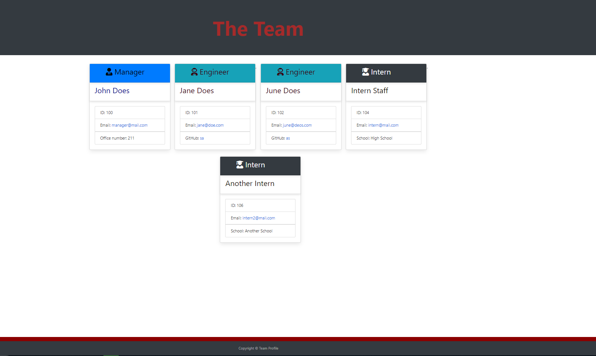
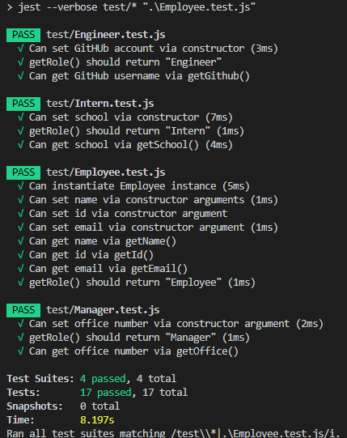

 # Team Profile Generator   
 
  
 
 ## Table of Contents
 
 - [Description](#description)
 - [Installation](#installation)
 - [Usage](#usage)
 - [License](#license)
 - [Contribution](#contributions)
 - [Test](#test)
 - [Authors](#authors)
 - [Questions](#questions)
 
  
 
 ## Description  
 
 This application helps generate the profile of a team made up of a Manager and Engineers and Interns. There should always be one manager but unlimited number of interns and Engineer. With prompt provided by inquirer, a user supplies the team information from command line and HTML page containign those details is generated. There is input validation that requires an external API call to github to ensure that the account exists. Most of the input validatgion functions are implemented using npm package. The application is built with Node.js, Inquirer.js, and features application of array manipulation, async call back function, jest testing, constructors, HTML page rendering from multiple files among others.
 
 ## Installation
 
 Install the dependency packages with 'npm install' command.
 
 ## Usage
 
 Please see below:
 
 
 
 ## License
 
 This project is licensed under:
 
  
 
 MIT
 
 ## Contribution
 
 Please contact me on my email [Email Address](anyaegbufrancis@gmail.com) or fork the repository from my github account: [Github Profile](https://github.com/anyaegbufrancis). Please make a pull request and we can review the updates, corrections or bug fixes together.
 
 ## Test
 
 All test scripts are in 'test' folder. just run 'npm test employee'. Please see the attached below:
 
 
 
 ## Authors
 
 The author of this project is: 
 
 Francis Anyaegbu. 
 
 To contribute, please refer to [Contributors](#contributors) section.
 
 ## Questions
 
 For questions, concerns, comments or your valued inputs regarging this project, kindly go to my Github page below:
   
 - [Github Profile](https://github.com/anyaegbufrancis)
